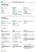

# Working with [!INCLUDE[d365fin](includes/d365fin_md.md)]Working with [!INCLUDE[d365fin](includes/d365fin_md.md)]
When performing business tasks, you interact with data in different ways, such as creating records and entering data, sorting and filtering data, writing notes, and outputting data to other applications.When performing business tasks, you interact with data in different ways, such as creating records and entering data, sorting and filtering data, writing notes, and outputting data to other applications.

For example, you can adjust the size and position of any page, expand the width of columns and increase the height of column headers, and change the sorting of data in columns.For example, you can adjust the size and position of any page, expand the width of columns and increase the height of column headers, and change the sorting of data in columns. And if you want to use the horizontal scroll bar to view all columns on a list page or on document lines, you will see that there is a vertical freeze pane to restrict some columns from scrolling.And if you want to use the horizontal scroll bar to view all columns on a list page or on document lines, you will see that there is a vertical freeze pane to restrict some columns from scrolling.

> [!TIP]
> For a print-friendly overview of the most used functions, choose the following image and download the PDF file.For a print-friendly overview of the most used functions, choose the following image and download the PDF file.
>
> 

> [!NOTE]
> In addition to the general UI functions described in this section, you can use other general functions that are more business-related.In addition to the general UI functions described in this section, you can use other general functions that are more business-related. For more information, see [General Business Functionality](ui-across-business-areas.md).For more information, see [General Business Functionality](ui-across-business-areas.md).

The following table lists some of the general functionality with links to topics that describe them.The following table lists some of the general functionality with links to topics that describe them.

| ToTo | SeeSee |
| --- | --- |
|Find a specific page, report, action, help topic, or partner extension.Find a specific page, report, action, help topic, or partner extension. |[Finding Pages and Information with Tell MeFinding Pages and Information with Tell Me](ui-search.md) |
|Get an overview of pages for your role and for other roles and navigate to pages.Get an overview of pages for your role and for other roles and navigate to pages.|[Finding Pages with the Role ExplorerFinding Pages with the Role Explorer](ui-role-explorer.md)|
| Filter data in views, reports, or functions by using special symbols and characters.Filter data in views, reports, or functions by using special symbols and characters. |[Sorting, Searching, and Filtering ListsSorting, Searching, and Filtering Lists](ui-enter-criteria-filters.md) |
|Learn the many general functions that help you enter data in a quick and easy way.Learn the many general functions that help you enter data in a quick and easy way.|[Entering DataEntering Data](ui-enter-data.md)|
|Learn how to quickly copy and paste data including by using keyboard shortcuts.Learn how to quickly copy and paste data including by using keyboard shortcuts.|[Copying and Pasting FAQCopying and Pasting FAQ](ui-copy-paste.md)|
| View or process data in specific date ranges.View or process data in specific date ranges. |[Working with Calendar Dates and TimesWorking with Calendar Dates and Times](ui-enter-date-ranges.md) |
| See which fields must be filled in.See which fields must be filled in. |[Detecting Mandatory FieldsDetecting Mandatory Fields](ui-mandatory-fields.md) |
|Understand how the computer locale affects the user interface and the Help site and how to change the language.Understand how the computer locale affects the user interface and the Help site and how to change the language.|[Changing Language and LocaleChanging Language and Locale](about-locale-language.md)|
|Learn how to interact with Excel from practically anywhere in [!INCLUDE[d365fin](includes/d365fin_md.md)]Learn how to interact with Excel from practically anywhere in [!INCLUDE[d365fin](includes/d365fin_md.md)]|[Viewing and Editing in ExcelViewing and Editing in Excel](across-work-with-excel.md)|
|Attach files, add links, or write notes on cards and documents.Attach files, add links, or write notes on cards and documents.|[Manage Attachments, Links, and Notes on Cards and DocumentsManage Attachments, Links, and Notes on Cards and Documents](ui-how-add-link-to-record.md)|
| Change basic settings such as company, work date, and Role Centre.Change basic settings such as company, work date, and Role Center. |[Change Basic SettingsChange Basic Settings](ui-change-basic-settings.md) |
|Get notified about certain events or changes in status, such as when you are about to invoice a customer who has an overdue balance.Get notified about certain events or changes in status, such as when you are about to invoice a customer who has an overdue balance.|[Manage NotificationsManage Notifications](ui-smart-notifications.md)|
| Change which and where UI elements are shown to fit your preferences.Change which and where UI elements are shown to fit your preferences.|[Personalise Your WorkspacePersonalize Your Workspace](ui-personalization-user.md) |
|Define, preview, print, or save reports and define and run batch jobs.Define, preview, print, or save reports and define and run batch jobs.|[Working with Reports, Batch Jobs, and XMLportsWorking with Reports, Batch Jobs, and XMLports](ui-work-report.md)|
| Manage the content and format of reports and documents, including which data fields of a report dataset appear on the report and how they are arranged, text style, images, and more.Manage the content and format of reports and documents, including which data fields of a report dataset appear on the report and how they are arranged, text style, images, and more.|[Managing Report and Document LayoutsManaging Report and Document Layouts](ui-manage-report-layouts.md) |
|Learn about features and capabilities that make [!INCLUDE[d365fin](includes/d365fin_md.md)] readily available to people with disabilities.Learn about features and capabilities that make [!INCLUDE[d365fin](includes/d365fin_md.md)] readily available to people with disabilities.|[Accessibility and Keyboard ShortcutsAccessibility and Keyboard Shortcuts](ui-accessibility.md)|

## Getting Around in Business CentralGetting Around in Business Central
Here's a short video about how to get around in [!INCLUDE[d365fin](includes/d365fin_md.md)].Here's a short video about how to get around in [!INCLUDE[d365fin](includes/d365fin_md.md)].

> [!VIDEO https://www.youtube.com/embed/zqz03iMihx0]

## See Related Training at [Microsoft Learn](/learn/paths/work-pro-data-dynamics-365-business-central/)See Related Training at [Microsoft Learn](/learn/paths/work-pro-data-dynamics-365-business-central/)

## See AlsoSee Also
[Getting StartedGetting Started](product-get-started.md)  
[Setting Up Business CentralSetting Up Business Central](setup.md)  
[General Business FunctionalityGeneral Business Functionality](ui-across-business-areas.md)  

## [!INCLUDE[d365fin](includes/free_trial_md.md)]
